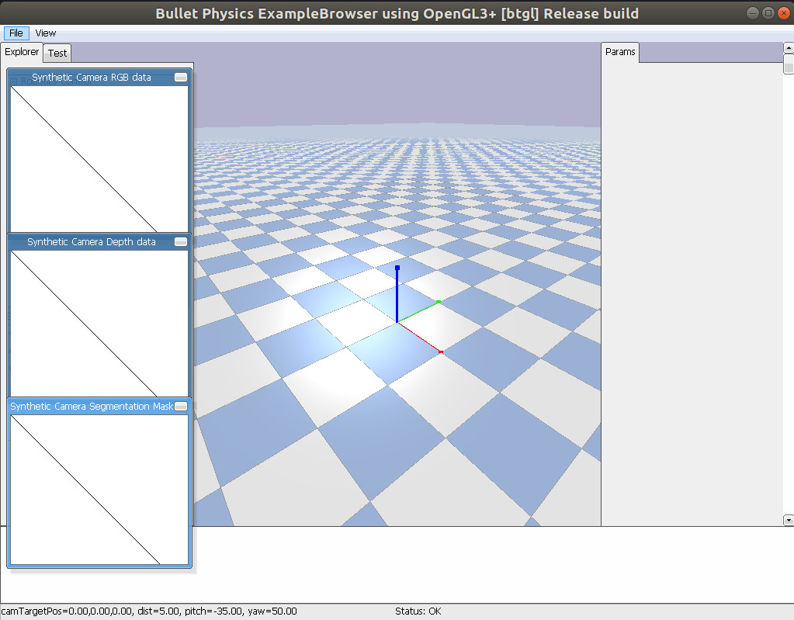

`pybulletX.init()` helps you create a simple pybullet application with the classic grid plane and gravity set to `-9.81` pointing downward.
```python
import pybulletX as px
px.init()
```



Under the hood, it does the following for you:
```python
import pybullet as p

client = p.connect(p.GUI)
p.setGravity(0, 0, -9.81)
p.setAdditionalSearchPath(pybullet_data.getDataPath())
p.loadURDF("plane.urdf")
```

An optional config can be passed to `init`. For example:
```python
import pybulletX as px
from omegaconf import OmegaConf

cfg = OmegaConf.load("pybullet.yaml")
px.init(cfg.pybullet)
```

```yaml title="pybullet.yaml"
pybullet:
  realTimeSimulation: False
  gravity:
    gravX: 0
    gravY: 0
    gravZ: -9.81
  timeStep: 0.001
  physicsEngineParameter:
    numSolverIterations: 2000
    solverResidualThreshold: 1e-30
    reportSolverAnalytics: True
```
